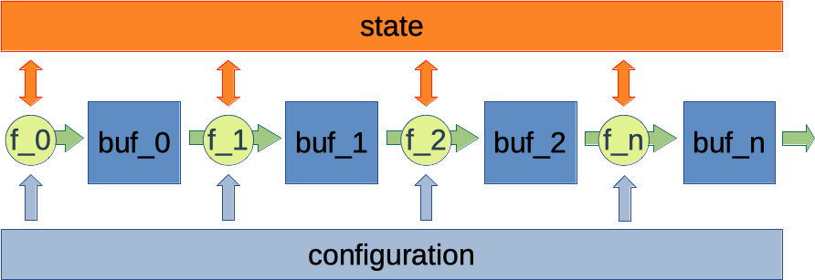

# stream-cpp

simple streaming library with two modes:

- `push` a processed buffer to a target stream
- `pull` a buffer from a source stream and process
- access read-only configuration
- update state



## dependency

this builds on the package [sizebounded](https://github.com/CodiePP/sizebounded).

## implementation

derive from class `stream` and provide an implementation of the function:

```
virtual int process(Ct const * const _config, St *_state, int _len, sizebounded<Vt,sz>& _buf) const
```
